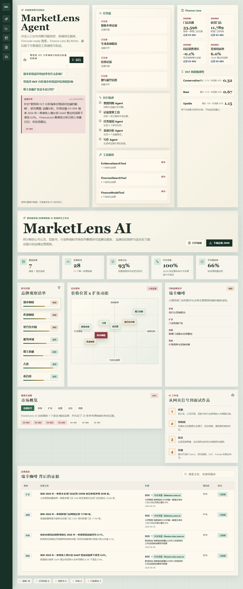

# MarketLens Agent

面向中国新茶饮 / 连锁咖啡品牌的多智能体投研研究系统。接收一个研究问题，先查本地证据库；证据不足时自动规划搜索任务、抓取公开网页、抽取结构化证据、校验来源；涉及金融分析时把经营指标转成 DCF-style 假设和敏感性场景；最后输出带证据引用的中文回答。全部 agent 调用、工具调用、trace 都被记录并可回放。



## 架构

```text
用户研究问题
  -> TriageAgent (LLM) 判断意图 + 改写查询
  -> EvidenceSearchTool 查询本地 Evidence DB (严格匹配)
  -> [证据 < 2 条] PlannerAgent (LLM) 拆研究任务
      -> SearchAgent 调 WebSearchTool (DuckDuckGo HTML)
      -> EvidenceExtractorAgent (LLM) 从片段抽取结构化 claims
      -> VerifierAgent (规则) 校验 URL / 重复 / 来源类型 / 置信度
      -> EvidenceStoreTool 写入 work/extracted_evidence.csv
  -> [金融类问题] FinanceLensAgent 生成经营假设和敏感性场景
  -> WriterAgent (LLM) 只引用 reviewed evidence 输出中文回答
  -> AgentRun 保存为 JSON session
  -> FastAPI / React Agent Console 展示结果
```

## 设计决策

- **自研 runtime，不用 LangChain**：BaseAgent / ToolRegistry / SessionStore / TraceLogger / TodoBoard 都在本仓库 `src/marketlens/agent/runtime.py`，代码量可控
- **Triage/Planner/Extractor/Writer 全部调 DeepSeek**：解析失败才降级到规则路径，不靠关键词路由
- **Verifier 纯规则不调 LLM**：URL 有效性、重复、来源类型、置信度都是是/否判断，没必要花 token
- **Research isolation**：Extractor 只返回结构化 JSON，原始 HTML 不进 Writer 上下文
- **触发搜索条件**：本地证据 < 2 条才搜，不靠关键词触发
- **种子数据隔离**：`data/evidence.csv`（28 条 reviewed）只读，新证据写 `work/extracted_evidence.csv`

## 技术栈

| 层 | 选型 | 理由 |
| --- | --- | --- |
| LLM | DeepSeek (OpenAI-compatible API) | 中文好、urllib 直调无 SDK 依赖 |
| 搜索 | DuckDuckGo HTML 接口 | 免费、无 key |
| 后端 | FastAPI + uvicorn | 端口 8765 |
| 前端 | React + Vite + TypeScript | 端口 5173，proxy 到后端 |
| 测试 | pytest | 103 tests passing |
| Runtime | 自研（BaseAgent / ToolRegistry / SessionStore / TraceLogger / TodoBoard） | 见 `src/marketlens/agent/runtime.py` |

## 项目结构

```
src/marketlens/
  agent/
    runtime.py        # BaseAgent / ToolRegistry / SessionStore / TraceLogger / TodoBoard
    llm.py            # LLMClient Protocol + DeepSeek + Fallback + Mock
    tools.py          # EvidenceSearchTool / WebSearchTool / FinanceModelTool / EvidenceStoreTool
    agents.py         # Triage / Planner / Search / Extractor / Verifier / FinanceLens / Writer
    finance.py        # FinanceModelTool 实现（spec §7.1）
    orchestrator.py   # 主编排链
  api.py              # FastAPI app
data/
  evidence.csv        # 种子证据库（28 条 reviewed，只读）
  finance_metrics.csv # FinanceLens 经营指标（10 条）
web/                  # React + Vite 前端
scripts/
  smoke_test_deepseek.py   # 验证 DeepSeek key
  demo_real_llm.py         # 真端到端演示
tests/                # 103 个测试
```

## 本地运行

### 1. 环境变量

复制 `.env.example` 为 `.env`，填入 DeepSeek API key：

```bash
cp .env.example .env
# 编辑 .env，填入 DEEPSEEK_API_KEY=sk-...
```

没有 key 也能跑——LLM client 会降级到 FallbackLLMClient，但 Triage/Planner/Extractor/Writer 不会真调 LLM。

### 2. Python 后端

```bash
python -m venv .venv
.venv\Scripts\activate          # Windows
# source .venv/bin/activate     # macOS/Linux
pip install -e ".[dev]"

# 启动 API（端口 8765）
python -m uvicorn marketlens.api:app --host 127.0.0.1 --port 8765
```

### 3. 前端

```bash
cd web
npm install
npm run dev -- --port 5173
```

### 4. 打开

```
http://127.0.0.1:5173
```

示例问题：
- 瑞幸价格战对利润率有什么影响？
- 帮我用 DCF 分析瑞幸价格战对估值的影响
- 霸王茶姬扩张是不是过快？

## Demo 脚本

不起前端也能跑：

```bash
# 验证 DeepSeek key 能用
python scripts/smoke_test_deepseek.py

# 跑两个示例问题的真 LLM 端到端演示
python scripts/demo_real_llm.py
```

## 测试

```bash
pytest
```

103 个测试全过，覆盖：
- LLM client 层（DeepSeek mock / Fallback / Mock）
- WebSearchTool（DuckDuckGo 解析 / 网络失败降级）
- 四个 agent 的 LLM 路径 + 规则降级
- Orchestrator 全链路（本地证据路径 / 研究路径 / 金融路径）
- FinanceLens spec §7.1（单店经济 / 税率 / 再投资率 / 3 个敏感性矩阵）
- 端到端 E2E（agent 顺序 / 金融假设 / 中文引用 / 真延迟 / 降级搜索）

## 运行时产物

- `data/evidence.csv`：公开来源证据表（28 条 reviewed，种子数据，只读）
- `data/finance_metrics.csv`：FinanceLens 经营指标（10 条）
- `data/processed/agent_demo.json`：前端 fallback 的 deterministic AgentRun
- `web/src/data/agent_demo.json`：React 控制台内置演示数据
- `work/agent_sessions/`：本地 API 运行后保存的 AgentRun JSON
- `work/extracted_evidence.csv`：搜索抽取的新证据（运行时生成，不污染种子）
- `screenshots/marketlens-agent-desktop.png`：Agent Console 桌面截图

## 来源纪律

只使用公开信息。弱来源不会被隐藏，而是通过 `needs_review` 或置信度体现。WriterAgent 只引用 `reviewed` 且带有效 URL 的证据；FinanceLens 输出是研究训练用的假设框架，不构成投资建议。

## 设计文档

- `docs/superpowers/specs/2026-06-20-marketlens-agent-v2-design.zh-CN.md` — v2 中文设计文档
- `docs/superpowers/specs/2026-06-20-marketlens-agent-v2-design.md` — v2 英文设计文档
- `docs/superpowers/plans/2026-06-20-v2.1-completion-summary.md` — v2.1 修复完成总结
- `docs/workflow_sop.md` — 研究工作流 SOP
- `docs/prompt_templates.md` — prompt 模板
- `docs/source_register.md` — 来源登记
